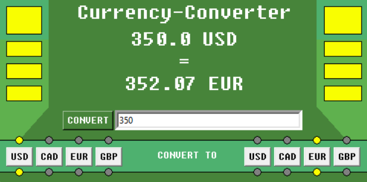

# Currency-Conversion-App

 A program that lets the user convert an amount of money between commonly used currencies.

## Table of Contents
- [About](#about)
- [Getting Started](#getting_started)
- [How to Use](#usage)
- [Authors](#authors)
## About 
This program was created in order to enhance my skills in using requests and obtaining data on the web. This program was written over the span of one day.
## Getting Started 
What you will need to run this program: 
- <em>Python</em>- To run this program, you must have some way to run a .py file. Also, this program was written using python 3.8.3, and has not been tested using any other version. You will also have to install <em>requests</em> to use the program.
## How to Use 
After installing and adding everything necessary, all you need to do is run the program, pick which currencies you want to convert to and from, enter the amount, and press convert.
## Author 
[@AlexHettle](https://github.com/AlexHettle) - Sole author of project
